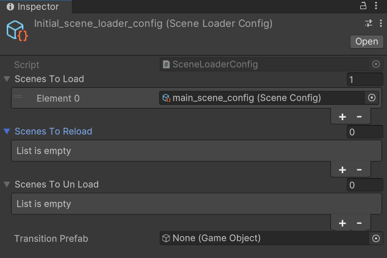

# Game scene loader

O GameSceneLoader tem por objetivo controlar e gerenciar adições de cenas, transições de cenas e descarregamento de cenas dentro de um jogo.

Comumente durante o desenvolvimento do jogo separamos os assets em cenas para garantir o carregamento dessas informações. Além de ser uma forma de organizar o trabalho também é necessário do ponto de vista de memória já que dependendo do tamanho do jogo não é possível carregar tudo para a memória do computador.

Assim é importante existir um sistema que controle o que está carregado ou não. Além do carregamento de memória outras operações são necessárias antes que o carregamento seja dado como concluído. Como por exemplo, carregar alguma informação da internet, configurar alguma relação entre os objetos no jogo, carregar um arquivo em disco. Assim só podemos dar uma cena como carregada quando todas as operações necessárias para a correta do jogo.

O sistema de GameSceneLoader serve a esse propósito, adicionar uma camada ao carregamento de assets da Unity a fim de garantir que todos os objetos, sistemas estejam funcionando quando o jogo já possa ser jogado.

# Utilização

O GameSceneLoader aceita uma configuração de cenas, que são divididas em 3 categorias: cenas carregadas, cenas descarregadas e cenas recarregadas.

- Cenas carregadas: a primeira cena será a cena principal e as demais serão cenas adicionais. Caso a primeira cena já esteja carregada, as próximas são adicionadas
- Cenas descarregadas: cenas que são descarregadas
- Cenas recarregadas: todas as cenas são descarregadas e carregadas novamente

Abaixo se encontra um exemplo de configuração das cenas

O GameSceneLoader deve ser adicionado como componente a um objeto na cena e então adicionada a configuração desejada.

# Limitações

- Atualização manual do nome das cenas
  - Cada cena deve ser adicionado o nome de forma manual