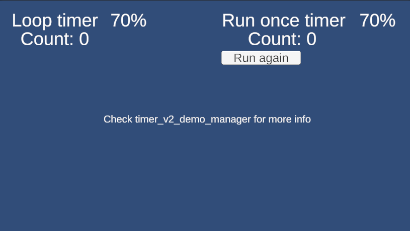

# Timer V2

Nova versão do timer. Esse timer pode ser instanciado em qualquer lugar do código.

Propriedades:

- CurrentTime
- RemainingTime
- Completion

Modo de utilização:

```csharp
// Timer em loop (defaut mode)
var loopTimer = new TimerV2(5f, () => {
    // do stuff when complete a loop
})
    .SetName("Loop counter timer")
    .Loop()
    .Start();

// Timer que roda apenas uma vez
var runOnceTimer = new TimerV2(5f, () => {
    // do stuff when finished
})
    .SetName("Loop run once timer")
    .RunOnce()
    .Start();
```

Para parar e retorna a execução do Timer

```csharp

// Pausa a execução do timer
loopTimer.Stop(); 

// Retoma a execução do timer de onde parou
loopTimer.Resume();
```

