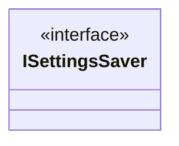

Sistema de Settings para o jogo.

É um sistema genérico que pode ser utilizado em qualquer jogo apenas importando seus scripts e prefabs.

# Forma de funcionamento

- SettingsSaver: classe responsável por persistir em uma lista os valores das opções.

- SettingsPanelController: gerencia o estado do painel de Settings.

- SettingsOptionSO: classe responsável por gerenciar a opção configurada. 
  - É nela que avisa aos controladores que o valor da opção foi alterado pelo evento **OnValueChange**.

Controllers: são as classe que gerenciam os recursos dentro do jogo

- AudioEffectsController
- MusicController

# Diagrama

## Futuro

- Adicionar sistema de persistência das opções em disco.