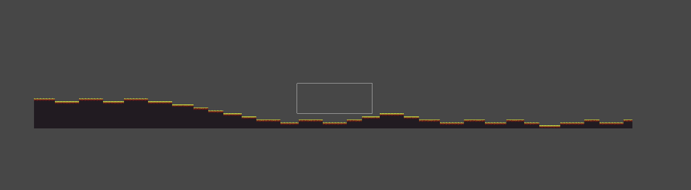
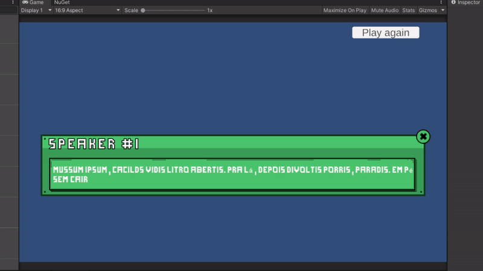
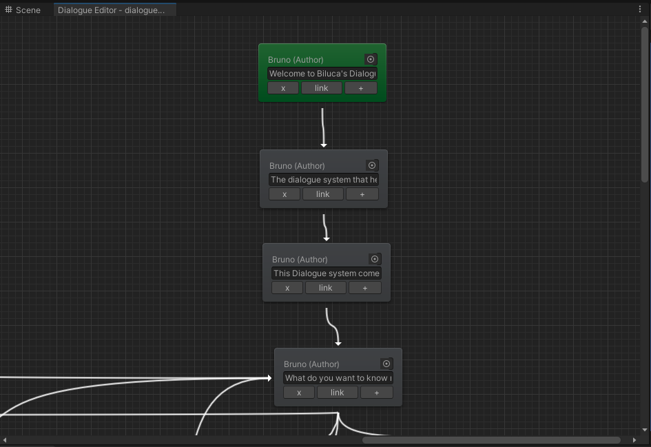

# UnityFoundation

# Dependencies

- Unity package Cinemachine
- Unity package Universal RP
- Unity package Text Mesh Pro (TMP)

- Nuget for Unity
  - Used to manage external nuget packages
  - https://github.com/GlitchEnzo/NuGetForUnity

- Csv Helper
  - Used on Dialgue System export/import features
  - https://joshclose.github.io/CsvHelper/

# Features

## Procedural platform generation

Location: UnityFoundation -> ProceduralGeneration -> PlatformBuilder -> ProceduralPlatform.prefab

Creates platform grid using the Random Walk Algorithm.

## Dialogue System

Location: UnityFoundation -> Systems -> DialogueSystem
Mais informações: UnityFoundation -> Systems -> DialogueSystem -> readme.md

Sistema genérico de Diálogos. Pode ser utilizado apenas importando os scripts.

- Exemplo de diálogo

- Exemplo do Editor de diálogo

