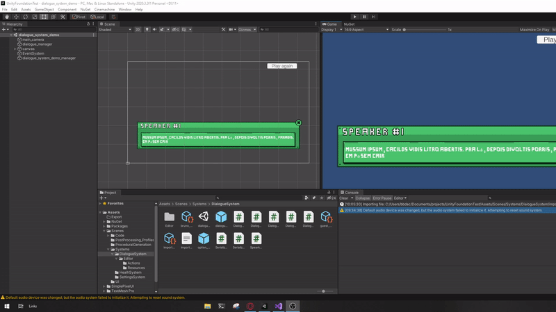

# Dialogue System

Sistema genérico de Diálogos.

Pode ser utilizado apenas importando os scripts.

Exemplo de diálogo construído utilizando o sistema

# Features

## Dialogue Editor

Janela de gerenciamento do fluxo do diálogo.

Principais funcionalidades:

- Setar linha do diálogo para ser a linha principal
- Adição de uma linha do diálogo
- Remoção de uma linha do diálogo
- Alteração da linha de diálogo
- Ligar uma linha de diálogo como próxima de outra linha de diálogo
- Remover a ligação de sequência de linhas de diálogo
- Importação de CSV
- Exportação de CSV

## Csv import/export

# Documentação

## Classes principais

### Módulo de jogo

- DialogueSO
  - Controla todos os nós do diálogo.

- DialogueNode
  - Referente a uma linha do diálogo, falado por um Speaker.

- SpeakerSO
  - Configuração do falante do diálogo.

- DialogueManager
  - Gerencia o curso do diálogo dentro do jogo.

- DialogueUI
  - Implementa as funcionalidades básicas do diálogo implementado nesse módulo
  - Serve como um template para a criação de uma janela de diálogo no jogo.

### Módulo editor

- DialogueEditor
  - Classe que define o Editor de diálogo utilizado na Unity

- IDialogueEditorAction
  - Interface que define uma ação possível na execuçaõ do Editor de diálogo.
  - Possíveis ações
    - AddDialogueNode: Adição de uma linha do diálogo
    - RemoveDialogueNode: Remoção de uma linha do diálogo
    - ChangeDialogueNodeAction: Alteração da linha de diálogo
    - LinkDialogueNodes: Ligar uma linha de diálogo como próxima de outra linha de diálogo
    - UnlinkDialogueNodes: Remover a ligação de sequência de linhas de diálogo

