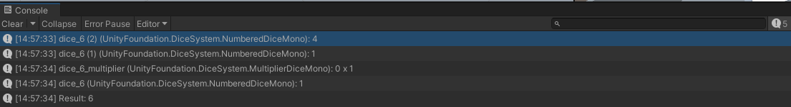
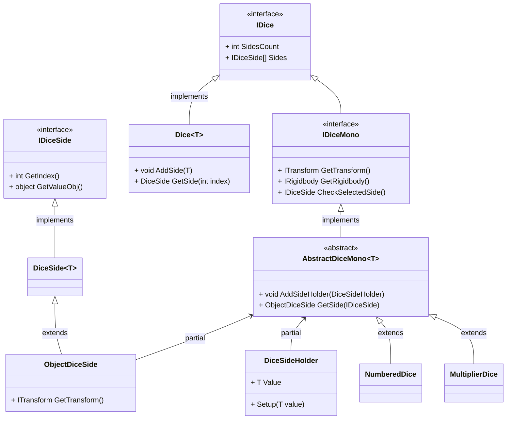
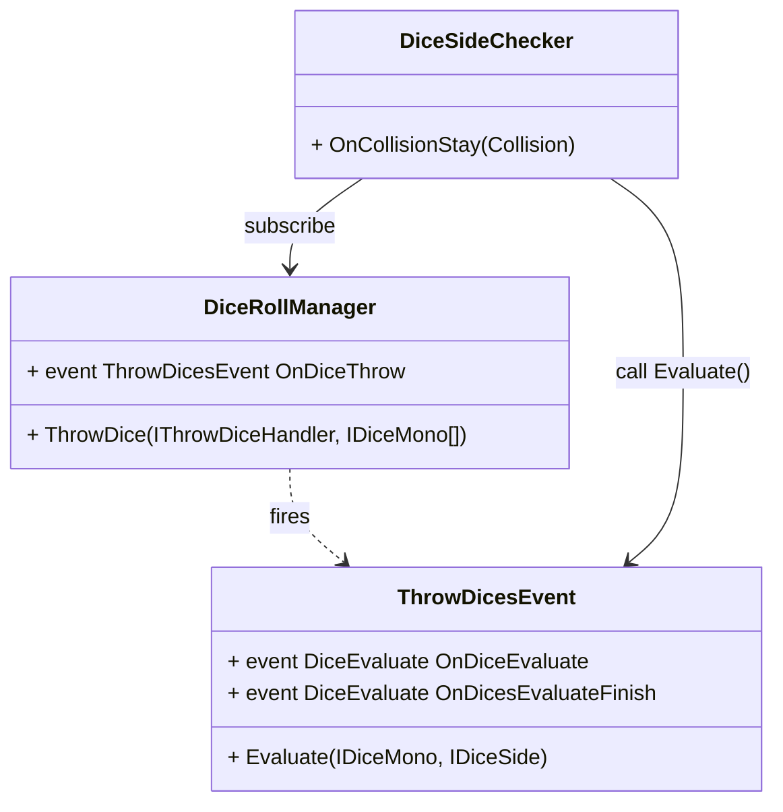

# Description

Dice System can be used for Dice-based games.

Includes two main functionalities:

- Basic Dice System
- Physical Dice System

The **basic dice system** can be used to make any type of dice-based game. It can be extendible to show the results on UI of any kind. The basic system has support for any type of Dice, so you can configure how many sides and what type of values those sides mean.

The **physical dice system** can be used to show physically correct dice. Is an extension of the Basic Dice System and can be expanded to any type of Dice.

# How to use

## Presets

*Coming soon*

[//]: # ( TODO: Scene setup )

## Extend Dices

*Coming soon*

[//]: # ( TODO: Scene setup )

# Sample Scene

The scene `Samples/dice_roll_example.unity` shows a usage of the Physical Dice System, with 4 Dices. 3 Numbered Dices and 1 Multiplier Dice. The result of when the dices are Throw is the sum of all Numbered Dices multiplier by the Multiplier Dice.

This sample demonstrates the system's flexibility in handling multiple dices, as with each dice evaluate prints on the console and when all dices finished being evaluated do the calculation.

# Class Diagram

[//]: # ( TODO: Adicionar a parte do DiceRollManager e dos Handlers )

## Dice check system

