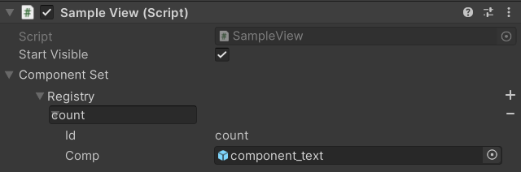

# View System

> 💡 Objetivo: Sistema gerenciador de telas, componentes e eventos relacionados a UI em games.

Esse sistema visa ter as funções comuns ao desenvolvimento de telas em games, como por exemplo:

- Controlar qual a tela está sendo exibida para o jogador
- Fechar telas que não devem aparecer ao jogador
- Controlar grupo de telas (HUD, Menu principal, Tela de batalha)
- Prover funcionalidades básicas para prototipação

## Extendendo de uma BaseView

Qualquer classe pode ser extendida de uma BaseView.

A ``BaseView`` é uma classe abstrata que gerencia o comportamento de gameobjects e provê algumas funções:

- Show
- Hide

A classe que estende a BaseView pode implementar um série de funções que serão executadas de acordo com o comportamento desejado:

- OnAwake
- OnShow
- OnFirstShow
- OnHide

## Decorando com uma View

Também é possível adicionar esse comportamento a qualquer `GameObject` por meio do ``SimpleView``.

A `SimpleView` é uma classe que extende o comportamento da `BaseView`, porém pode ser adicionada a um GameObject sem nenhum outro tipo de configuração adicional.

## Utilizando um ComponentizedView

Uma view pode determinar os componentes que a compõe. Para isso uma classe pode extender de `ComponentizedView` e registrar os componentes necessários.

```csharp
public class SampleView : ComponentizedView
{
    private int counter;
    private string counterText= "Componente da Tela Asmodeus\n\nContagem de aberturas: <count>";

    protected override IEnumerable<ViewComponent> RegisterComponents()
    {
        yield return new("count", UpdateCounter);
    }

    public void UpdateCounter(GameObject go)
    {
        var text = counterText.Replace("<count>", (counter++).ToString());
        go.GetComponent<TextMeshProUGUI>().text = text;
    }
}
```

Esse exemplo irá configurar o componente que será exibido da seguinte forma no inspector.



Assim o desenvolvedor pode configurar os componentes utilizados na exibição dessa view de forma visual e muito simples. Esses componentes serão gereciados como os demais.

## Grupos de Views

As Views podem ser organizadas em grupos para melhor gerenciamento.

Pense por exemplo em uma HUD que pode aprensetar vários componentes, em vez de adicionarmos todos a apenas uma View podemos criar várias Views e um grupo para organizá-las.

Outra vantagem é que podemos ter uma mesma view em vários grupos distintos, podendo flexibilizar o comportamento de como exibimos essas informações na tela.

### Grupo de Views

Implementado pela classe `ViewGroup`.

Esse simples grupo de views organiza várias views e provê as seguintes funções:

- Register
- Show
  - Exibe todas as views registradas ao grupo
- Hide
  - Esconde todas as views registradas ao grupos

### Grupo exclusivo de views

Implementado pela classe `ExclusiveViewGroup`.

Garante que uma view tem prioridade sobre todas as outras. 

A view principal registrada quando exibida esconde todas as outras views, e quando ela está sendo exibida nenhuma outra view no grupo pode ser exibida.

Funções

- RegisterMain
- Register
- ShowMain
- HideMain

## Componentes

O pacote do `ViewSystem` também já disponibiliza vários componentes com funções específicas. Esses componentes podem ser utilizados para prototipação ou produção.

### ViewControllerButton

Provê a funcionalidade de controlar o estado de visibilidade de uma View.